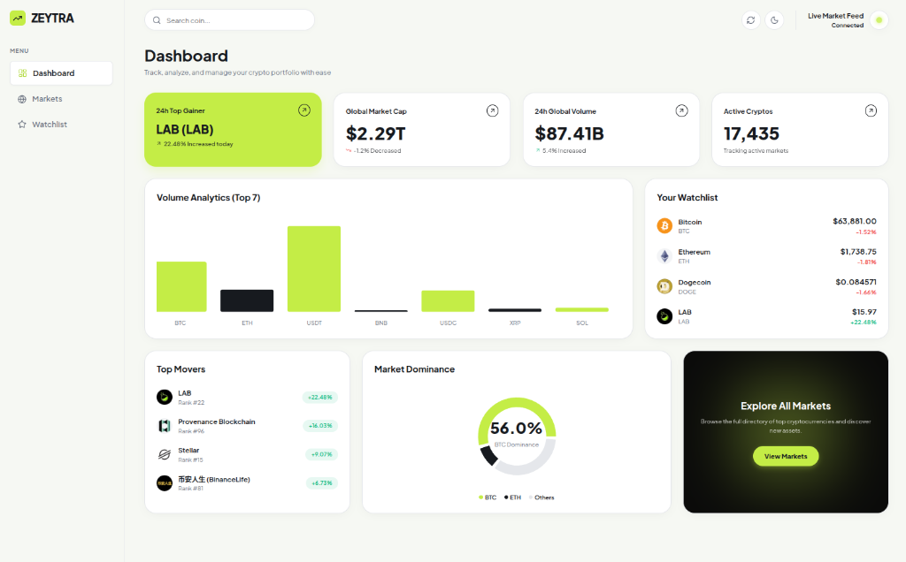

# Zeytra | Crypto Market Pulse

**Live Demo:** [https://zeytra.vercel.app](https://zeytra.vercel.app)



A high-performance cryptocurrency dashboard designed to track top markets, visualize real-time data, and manage a persistent user watchlist.

## Tech Stack

This project was built using modern frontend technologies prioritized for performance, type safety, and scalability.

* **React 18 & Vite:** Chosen for blazing-fast local development (HMR) and optimized production builds. React was selected to easily manage the complex, highly interactive state of the dashboard.
* **TypeScript:** Used strictly across the entire application to ensure type safety (e.g., rigid API response typing) and catch runtime errors during development.
* **Recharts:** Chosen over Chart.js or D3 because it provides declarative, React-native SVG charting components out of the box, making it easy to build responsive and lightweight data visualizations.
* **Lucide-React:** Used for clean, consistent, and scalable SVG iconography.
* **Vanilla CSS Modules:** Selected over Tailwind CSS to enforce a strict, isolated, and highly custom styling architecture (Bento box grids, complex neon-gradients, and dark mode variables) without cluttering component logic.
* **Context API (State Management):** Instead of introducing the heavy bundle size of Redux, React's native Context API was used to cleanly decouple global state (`MarketData`, `Watchlist`, `Theme`) from UI components.

## Setup Instructions

To run this project locally, follow these steps:

1. **Prerequisites:** Ensure you have [Node.js](https://nodejs.org/) installed (v16+ recommended).
2. **Clone the repository:**
   ```bash
   git clone https://github.com/aashiq-q/zeytra.git
   cd zeytra
   ```
3. **Install dependencies:**
   ```bash
   npm install
   ```
4. **Run the development server:**
   ```bash
   npm run dev
   ```
5. **View the App:** Open your browser and navigate to `http://localhost:5173`.

> **Note:** This project uses the public CoinGecko API. If you experience missing data or errors on the dashboard, you may have hit CoinGecko's rate limit. Simply wait 60 seconds and refresh the page.

## Trade-offs & Future Improvements

To deliver this project efficiently, the following trade-offs were made:

1. **API Rate Limiting Strategy:** 
   * *Trade-off:* The public CoinGecko API strictly throttles requests. To mitigate this without requiring the user to supply their own API key, I implemented a 60-second in-memory cache and graceful error handling. 
   * *Improvement:* If I had more time, I would implement an intermediate Node.js/Express backend server with Redis caching to completely mask the rate limit from the frontend and securely handle an enterprise API key.
2. **State Management Complexity:**
   * *Trade-off:* React Context is perfect for this project's current scope. However, for the high-frequency live WebSocket prices, passing state down the tree caused unnecessary re-renders of heavy SVG charts. I bypassed this by creating localized micro-components (e.g., `LivePriceText`).
   * *Improvement:* If the project scaled to include complex trading logic or deeper charting, I would migrate to a more granular atomic state manager like Jotai or Zustand to prevent unnecessary render cycles natively.
3. **Historical Chart Data:**
   * *Trade-off:* The 7-day sparkline charts currently pull standard arrays from the `/markets` endpoint rather than making 100 individual requests to `/market_chart`. This was done to preserve performance and respect rate limits.
   * *Improvement:* With more time, I would implement lazy-loading for the charts. Clicking a coin would trigger a dedicated fetch for high-fidelity historical candle data.
4. **Testing Coverage:**
   * *Trade-off:* Manual and automated linting was heavily utilized to ensure stability, but formal unit testing was bypassed to prioritize architectural setup and UI polish.
   * *Improvement:* I would add Vitest and React Testing Library to write unit tests for the `api.ts` data transformations and the `WatchlistContext` localStorage persistence.
